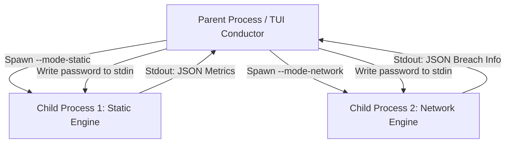

# ⚡ Universal Password Strength Analyzer ⚡

A high-performance, cross-platform, single-binary CLI password strength analyzer. The tool uses a **Master-Worker Process Architecture** to perform static entropy audits and zero-knowledge HaveIBeenPwned database checks concurrently without blocking terminal UI responsiveness.

---

## 🚀 Key Features

*   **Vibrant Terminal Dashboard**: A high-fidelity TUI dashboard built with Go's `bubbletea` and `lipgloss` rendering engines.
*   **Information-Theoretic Entropy Audit**: Computes Shannon Entropy ($E = L \times \log_2(R)$) to measure baseline mathematical strength.
*   **Zero-Knowledge Breach Checking**: Queries the HaveIBeenPwned API safely using the **k-Anonymity** model. Plainttext passwords never leave your machine; only the first 5 characters of the SHA-1 hash are transmitted.
*   **Master-Worker Process Isolation**: Spawns concurrent processes for CPU-bound computations and network requests to guarantee instant interface painting.
*   **Zombie Process Resiliency**: Subprocesses automatically self-terminate if the parent process drops offline or is interrupted early (Ctrl+C).

---

## 📦 Installation

### Option A: Automated Global Installation (Recommended)
Our automated bootstrapper detects your OS/Architecture, verifies or installs system dependencies (like `curl` or Go compiler), compiles/downloads the tool, runs a self-test, and copies it to a global binary directory (`/usr/local/bin` or `/usr/bin`).

Open your terminal in the repository root and run:
```bash
./install.sh
```
*Note: The script may prompt you for your `sudo` password to finalize global directory copies.*

---

### Option B: Building from Source Manually
If you want to compile target binaries manually, we provide script support:

*   **On Windows (PowerShell)**:
    ```powershell
    .\build.ps1
    ```
*   **On Linux / macOS**:
    ```bash
    ./build.sh
    ```

This compiles optimized binaries for all support matrices (`linux`, `darwin`, and `windows` for both `amd64` and `arm64` architectures) and places them inside the `dist/` directory.

---

## 🛠️ Usage

### 1. Interactive TUI Mode
Run the tool without arguments. You will be prompted securely for your password (characters will be hidden as you type):
```bash
pass_analy
```
Alternatively, pass the password directly to skip the prompt:
```bash
pass_analy "mySecurePassword123!"
```
*Press `Q`, `ESC`, or `Ctrl+C` to close the dashboard.*

### 2. Static Checker Mode (`--mode-static`)
Ideal for local script pipelines. It reads a password from standard input (`stdin`) and outputs offline geometry metrics, Shannon Entropy, and pattern repetitions in JSON format:
```bash
echo "myPassword123!" | pass_analy --mode-static
```

### 3. Network Breach Mode (`--mode-network`)
Reads a password from `stdin` and queries HaveIBeenPwned API via k-anonymity. Returns whether it was leaked and its breach count in JSON format:
```bash
echo "password" | pass_analy --mode-network
```

---

## 📐 Architecture & Data Flow


